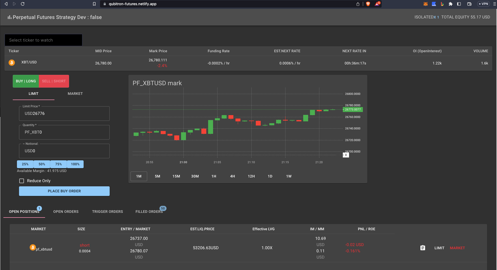

## Version Info

# 가상화폐 거래소 설명

데모 페이지 

[https://qubitron-futures.netlify.app/](https://qubitron-futures.netlify.app/)

### 메인화면

# Glossary 용어사전

### 상단 바

Dev/Production 서버 여부 , 현재 설정된 레버리지 및 거래 모드 (Isolated x1), 현재 총 자산 정보 USD

### Ticker Bar (시세 정보 바) 실시간 업데이트 1초 주기

Ticker : 현재 거래중인 선물 정보

Mid Price : 최고 매수가격[bid]와 최저 매도가[ask]의 중간값

Mark Price : 마켓 가격 USD 및 등락률 %

Funding Rate : 시간당 지불해야할 펀딩 수수료 (+ 인경우 Long 포지션이 Short 포지션에 지불, -인경우 Short 포지션이 Long 포지션에게 지불)

Est. Next Rate : 다음 예상 펀딩비

Next Rate In : 다음 펀딩비율 변경 까지 남은 시간

OI : 미청산 계약

Volume : 거래량

### 캔들 차트 정보

1분, 5분, 15분, 30분, 1시간, 4시간, 12시간, 1일, 1주 단위 변화량 선택 가능

### 주문폼

롱 주문/숏 주문

Limit 지정가 거래

Limit Price : 지정가 

Quantity : 주문 수량

Notional : 달러 환산가

25% ,50%, 75% 100% : 전체 증거금 대비 주문할 금액 비율

Market 시장가 거래

Quantity : 주문 수량

Notional : 달러 환산가

25% ,50%, 75% 100% : 전체 증거금 대비 주문할 금액 비율

### 오픈 포지션

Market : 마켓 현재 거래중인 선물

Size : 포지션 방향 (Short/Long) 및 주문수량

Entry/Market : 진입가/시장가

EST.Liq Price : 예상 청산가격

Effective LVG : 실 레버리지 비율

IM / MM : 개시 증거금 / 유지 증거금

Pnl / ROE : 손익손실비율

Limit : 지정가 포지션 정리

Market : 마켓가 포지션 정리

### 대기 주문

Date & Time : 거래 시간

Market : 마켓 현재 거래중인 선물

Side : 포지션 방향 

Price : 주문가

Remaining : 최초 주문량 대비 주문 완료량

Reduce Only : 반대 매매시 포지션 줄일것인지 여부

Edit : 주문 변경

Cancel : 주문 취소

# 거래 시나리오 예시

* 실주문시에는 레버리지 설정을 하여 1~50 배수를 설정가능하나, 본 데모에서는 청산을 방지하기위해 1배로 고정한 비율만 사용이 가능한 상태이다.

### Long 포지션 주문

현재 시장가격이 떨어지고 있으나 향후 상승할것으로 기대되어 Long 포지션 주문을 하기로 하고, 총 증거금의 25%를 주문하기로 하였다. 

상단의 초록색 Buy|Long  버튼을 누르고, 25% 버튼, 이후 Place Buy Order 버튼을 눌러 주문한다

대기주문 현황

이후 대기주문에 추가된것을 확인 할 수 있다.

시장가와 지정가와 비슷해지는 시점이 오면 주문이 마감되고 대기중인 주문에서 사라지게 된다.

### Short 포지션 주문 시나리오

시장상황을 보니 앞으로도 장하락이 예상되어 숏포지션 주문을 하기로 하여, 증거금의 25% 를 숏포지션 주문으로 하였다. 상단의 빨간색 Sell|Short 버튼을 누른뒤 ,25% 버튼, 이후 Place Sell Order 버튼을 눌러 주문한다

포지션 현황

예상대로 가격이 떨어져 이득을 보고 있는 상황이다 PNL 이 초록색으로 변한것을 참고

현재 시점에서 익절을 하기위해 마켓가로 포지션을 즉시 정리하기로 하여 Market 버튼을 눌러 포지션을 정리하였다. 

시장가 포지션 정리시에는 현재 가장 최고 매수가의 1%를 넘는 가격으로 정리할 수 있다. IOC 주문이기 때문에 즉시 주문이 마감된다.

또는 지정가 버튼을 눌러 지정가를 재지정하여 정리하는 것도 가능하다. * 현재는 데모상의 편의를 위해 재지정가를 최신 시장가격으로 자동 반영하도록 해두었다. 

잠시뒤 즉시 포지션이 정리되었다.

정리된 포지션 이력은 Filled Orders에서 확인가능하다.

